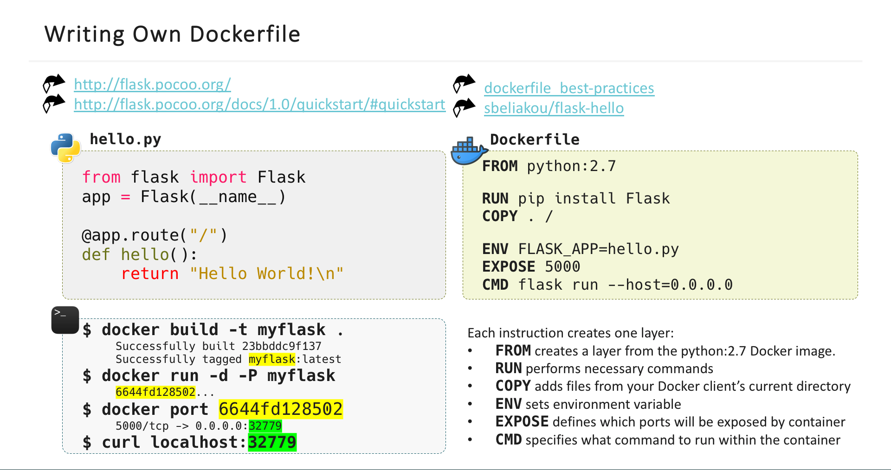

# Run Python Flask Application



## Usefull Links
- http://flask.pocoo.org/
- http://flask.pocoo.org/docs/1.0/quickstart/#quickstart
- https://docs.docker.com/develop/develop-images/dockerfile_best-practices/

## Develop Application

[hello.py](hello.py)
```python
from flask import Flask
app = Flask(__name__)

@app.route("/")
def hello():
    return "Hello World!\n"
```

## Develop Dockerfile for the Custom Image
[Dockerfile](Dockerfile)
```Dockerfile
FROM python:2.7

RUN pip install Flask
COPY . /

ENV FLASK_APP=hello.py 
EXPOSE 5000

CMD flask run --host=0.0.0.0
```

Each instruction creates one layer:
- **FROM** creates a layer from the python:2.7 Docker image.
- **RUN** performs necessary commands
- **COPY** adds files from your Docker client’s current directory
- **ENV** sets environment variable
- **EXPOSE** defines which ports will be exposed by container
- **CMD** specifies what command to run within the container

## Build Custom Image

```bash
docker build -t myflask
```

## Run Application

```bash
# Bind "Exposed" container port 5000 to localhost:5000
docker run -d -p 5000:5000 myflask

# Bind "Exposed" container ports to random ports on localhost
docker run -d -P myflask

# Get ports details:
docker port << CONTAINER ID >>
```

Options details:
- "-d" run container in detached mode (as service in background)
- "-p X:Y" bind exact container port "Y" to exact host port "X"
- "-P" bind all container exposed ports to random ports on the host

## Stop Application and Clean Up

```
docker stop << CONTAINER ID >>
docker rm << CONTAINER ID >>

docker rm $(docker stop << CONTAINER ID >>)

docker rm -f << CONTAINER ID >>
```
